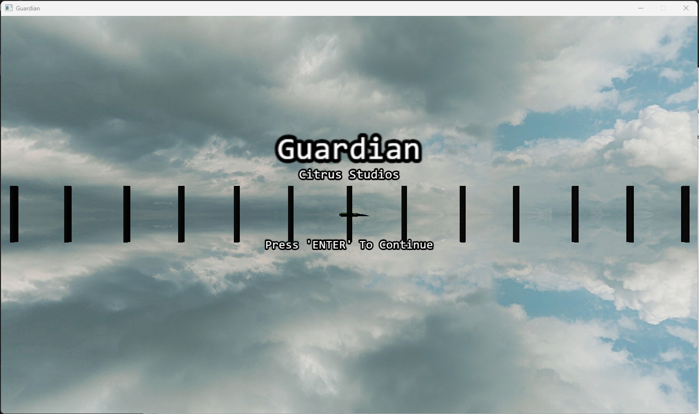
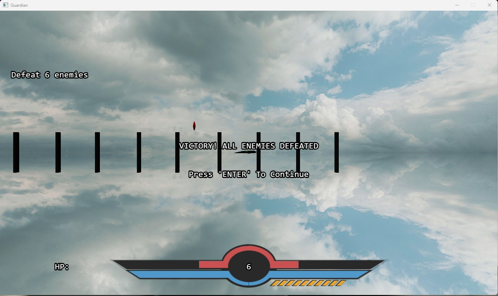
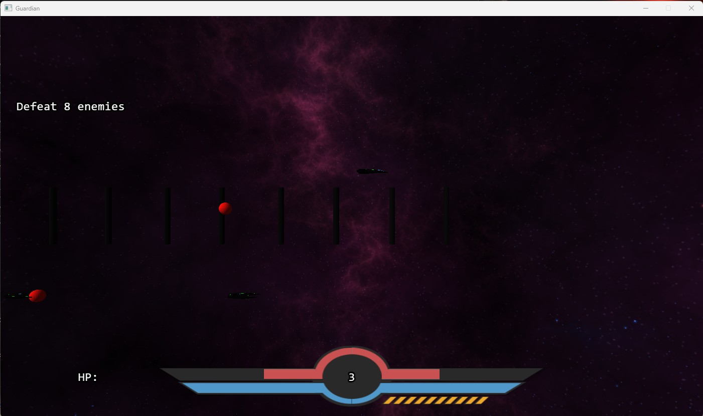
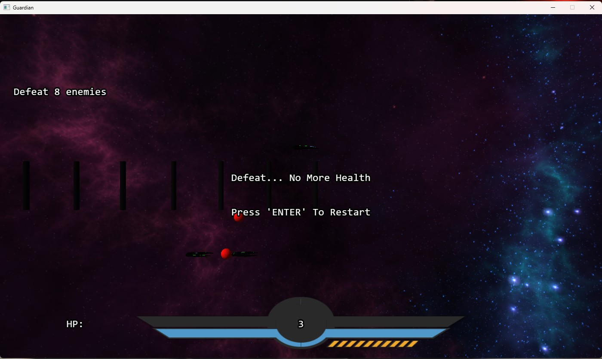

# Guardian
**Guardian** is a 2D side-scrolling space shooter built with a custom game engine developed using **DirectX 11**. In this project, I collaborated with a small team to create a complete game from scratch — including our own rendering, input, and physics systems.

---

## About the Game

In **Guardian**, you pilot a spacecraft through side-scrolling levels filled with enemies and obstacles. Inspired by classic shooters and platformers, the game challenges players to time their attacks, dodge enemy fire, and reach the final zone. Each level increases in difficulty, and player actions are tightly synced with keyboard input for an arcade-style experience.

---

## My Contributions

As one of the core programmers, I was responsible for **everything related to the player character**, including:

- Implementing all **movement and acceleration systems**
- Programming **basic and special attacks**
- Handling **collision detection and response**
- Creating **keyboard input mappings** for movement and combat
- Tuning gameplay feel and response to player actions
- AI Enemy behavior adjustments

My code interfaced directly with our engine’s custom input and physics subsystems.

---

## Built With

- **Custom C++ Engine**
- **DirectX 11** (rendering, input, and audio)
- Engine included our own sprite rendering, animation, and collision layers

> This project was entirely built from scratch — no Unity or Unreal.

---

## Screenshots

  
  

  
  

## Gameplay Demo

  

## 🎮 Play the Game

You can download and play the final build of **Guardian** here:

[Download Windows Build (.zip)](https://drive.google.com/file/d/1csX-HdPPMMZ8NsspVePYpqaCYOS6CVEW/view?usp=drive_link)

After downloading, unzip the folder and inside the bin folder run `ExampleSpaceGame.exe`. No installation required.

## 🙌 Credits

Developed by a student team at Full Sail University.

- Joshua Bray
- Wyatt Moore
- Gwilym Hernandez
- Andres Gutierrez
- Ricardo Rodriguez

